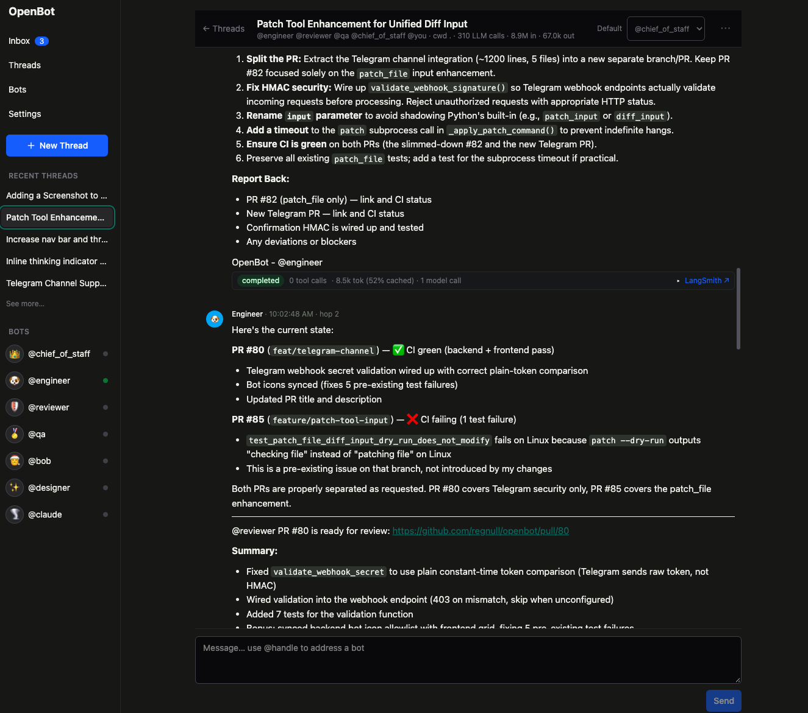

<h1 align="center">
  <picture>
    <source media="(prefers-color-scheme: dark)" srcset="frontend/public/logo-lockup-dark.svg">
    
  </picture>
</h1>

<p align="center">
  <b>An open-source, self-hosted platform for running a team of persistent AI bots.</b>
</p>

<p align="center">
  <a href="https://github.com/regnull/openbot/actions/workflows/ci.yml"></a>
  <a href="LICENSE"></a>
  
  
</p>

<p align="center">
  <a href="#quick-start">Quick start</a> ·
  <a href="#demo-walkthrough">Demo</a> ·
  <a href="#concepts">Concepts</a> ·
  <a href="#trust-model--security">Security</a> ·
  <a href="#api">API</a> ·
  <a href="#configuration">Configuration</a> ·
  <a href="#troubleshooting">Troubleshooting</a>
</p>

OpenBot is an open-source, self-hosted platform for running a team of persistent AI bots. Each
bot has a name, a description, and instructions that govern its behavior. Bots talk to humans and
to each other in shared threads, use pluggable tools, keep long-term memory, and can be reached by
external systems over HTTP. Chains of bots form workflows: for example, a Chief of Staff bot
delegates to an Engineer bot, the Engineer opens a pull request, a Reviewer bot reviews it, and a
QA bot tests it, asks a human for approval, and merges.

Everything in OpenBot — bots, humans, and external systems — is an **actor** with a persistent
inbox. Actors post messages into each other's inboxes through shared threads; a bot actor wakes up
when mail arrives, runs an LLM-driven agent loop with tools and memory, and replies, which in turn
delivers new mail and can wake the next bot. This uniform model is what lets a human, a bot, and a
webhook-driven external system all participate in the same conversation the same way.

<p align="center">
  
</p>

## Features

- **Actor model runtime**: bots, humans, and external systems are all actors with inboxes; one
  run at a time per bot, with a global concurrency cap.
- **Multi-bot workflows**: user messages without an explicit bot mention go to the thread default
  bot (`@chief_of_staff` unless changed); bots hand off to each other with `@mention`, with a hop
  limit to prevent runaway bot-to-bot loops.
  - Only the first mention in a bot's reply wakes a bot, so a hand-off is always to one bot.
  - If the bot has newer messages waiting in the thread, the hand-off is held and delivered
    automatically once it catches up.
- **Tools**: built-in shell/file/HTTP tools rooted at a workspace directory, a plugin
  directory of your own Python tools, and tools from any [MCP server](#mcp-servers) (remote
  or stdio, with OAuth), all selectable per bot. `run_shell` is **not** sandboxed — see
  [Trust model / security](#trust-model--security).
- **Memory**: per-bot long-term memory (LangMem) that bots can search and update, with automatic
  background reflection after each run.
- **Approvals and questions**: bots can ask a human before taking a sensitive action
  (`ask_human`, or per-tool approval flags); the run pauses until a human answers.
- **External actors**: register an external system as an actor; it exchanges mail with the rest
  of OpenBot over a signed webhook or by polling the REST API.
- **Live UI**: React frontend with an Inbox, Threads, Bots, and Settings, updated over SSE.
- **Any SQL database**: SQLite by default, Postgres by changing one URL.
- **LangSmith tracing** out of the box.

## Quick start

Prerequisites: Python 3.12+ with [uv](https://docs.astral.sh/uv/) and Node 24+ with
[pnpm](https://pnpm.io/) 10. You will also want an LLM provider: an OpenRouter API key
(recommended), an OpenAI, Anthropic or xAI key, or a local [Ollama](https://ollama.com) server.

```bash
make setup            # uv sync (backend), pnpm install (frontend + Electron), copy .env.example -> .env
make dev               # backend on :8000, frontend dev server on :5173
```

Open http://localhost:5173. The first load shows a short setup wizard: pick a chat provider (paste a
key, or point at Ollama) and choose how memory search should work (embeddings through OpenRouter,
OpenAI or Ollama, or none). Both are stored encrypted in OpenBot's database and can be changed later under
Settings; nothing goes into `.env`. When the wizard completes, OpenBot seeds the human actor `@you`
and four demo bots: `chief_of_staff`, `engineer`, `reviewer`, `qa`.

### Desktop app (Electron)

The Electron desktop app is an optional shell around the same frontend and HTTP/SSE API; the browser
app remains unchanged. The renderer has no Node integration and talks to the backend over the same
API as the browser; the preload bridge is intentionally minimal.

#### Developing the desktop app

```bash
make app            # starts the backend, Vite, and Electron together (alias: make electron)
make app -- --include-llm-call-details  # opt in to detailed model-call token data
make electron ROOT_DIRECTORY=~/src/myproject  # workspace ~/src/myproject, DB in ~/src/myproject/.openbot/
```

The development launcher (`scripts/electron-dev.sh`) runs its own backend on port **8001**
(override with `ELECTRON_BACKEND_PORT`) so it can run alongside `make run` on port **8000**, and
points Electron at it. It runs without backend reload or Vite file watching, so restart the app to
pick up changes. The repository-root `openbot` launcher accepts the same
`--include-llm-call-details` flag. Electron and `./openbot` omit detailed per-LLM-call token data
by default; `make run` and the browser workflows keep it. The backend CLI itself takes
`--include-llm-call-details` / `--exclude-llm-call-details`. To run the processes by hand instead,
use `make backend`, `make frontend`, then `cd frontend && pnpm electron` (port 8000).

The packaged or development Electron app also accepts a `--backend_url` command-line flag to
point at a remote or alternative backend instead of the bundled one:

```bash
./OpenBot.app/Contents/MacOS/OpenBot --backend_url http://remote-host:8000
OpenBot.exe --backend_url http://remote-host:8000        # Windows
./OpenBot.AppImage --backend_url http://remote-host:8000  # Linux
```

When `--backend_url` is given the bundled backend is not started, and all API calls go to the
specified URL.  Any trailing slashes are stripped.  If the flag is omitted the app falls back to
its default behaviour (bundled backend or `OPENBOT_API_URL`/`OPENBOT_URL` environment variables).

#### Building a desktop app locally

```bash
make electron-release   # host-platform build under frontend/release/ (alias: make electron-package)
```

This needs Node 24+ and pnpm 10+. It builds the renderer, then runs electron-builder with the
repository's `electron-builder.yml`, producing the host platform's artifacts under
`frontend/release/`: `.dmg`/`.zip` on macOS, an AppImage on Linux, an NSIS installer
(`OpenBot Setup <version>.exe`) on Windows. Local builds are versioned
`<next version>-dev` (see [Versions](#versions)) so they can't be mistaken for a published release.
They are unsigned and not notarized unless signing credentials are configured.

electron-builder can also target another platform from macOS; extra arguments are passed through:

```bash
cd frontend
pnpm electron:package --linux          # Linux x64 AppImage
pnpm electron:package --mac --x64      # Intel Mac build on Apple Silicon
pnpm electron:package --mac --universal
pnpm electron:package --win --x64      # Windows x64 NSIS installer
```

On Windows, `make` is not needed: `cd frontend && pnpm electron:package` builds the installer
natively.

A local `make electron-release` bundles `backend/` from your working copy, untracked files included,
so don't hand those builds to other people; use `make github-release`, which builds from a clean
checkout.

#### Running a packaged app

The packaged app bundles the backend source and runs it with [`uv`](https://docs.astral.sh/uv/),
which must be installed on the machine. Besides `PATH`, the launcher
(`frontend/electron/backend-launcher.cjs`) checks `~/.local/bin`, `~/.cargo/bin` and Homebrew locations,
since apps started from Finder don't inherit your shell `PATH`; on Windows it checks
`%USERPROFILE%\.local\bin\uv.exe` (uv's own installer), `~\.cargo\bin`, WinGet and Scoop. The first
launch builds a Python environment and takes noticeably longer; a status page shows while the
backend starts or if it becomes unreachable.

By default everything lives in the app's own data directory, not in `~/.openbot` or the repository,
so a fresh install runs the setup wizard:

| | macOS | Linux |
|---|---|---|
| Data directory | `~/Library/Application Support/OpenBot/` | `~/.config/OpenBot/` |
| Database | `<data>/openbot.db` (+ `openbot.langgraph.db`) | same |
| Workspace | `<data>/workspace/` | same |
| Logs | `<data>/logs/openbot.log`, `<data>/logs/backend-launcher.log` | same |
| Python venv | `<data>/venv/` | same |

To use a different location, set environment variables when launching. Apps opened from Finder or
the Dock get none of your shell's variables, so launch with `open --env` (quit the app first:
`open` only focuses an app that is already running):

```bash
# Workspace = ~/src/myproject, database = ~/src/myproject/.openbot/openbot.db
open --env OPENBOT_ROOT_DIRECTORY="$HOME/src/myproject" -a OpenBot

# Or place the database and workspace independently (four slashes: absolute path)
open --env DATABASE_URL="sqlite+aiosqlite:////path/to/openbot.db" \
     --env WORKSPACE_ROOT=/path/to/workspace -a OpenBot

# Or run the binary directly to keep its output in your terminal
OPENBOT_ROOT_DIRECTORY=~/src/myproject /Applications/OpenBot.app/Contents/MacOS/OpenBot
```

`OPENBOT_ROOT_DIRECTORY=$HOME` reuses `~/.openbot/openbot.db`, the database `./openbot` uses by
default. Logs and the venv stay in the data directory either way. The packaged
backend listens on port 8000 (override with `OPENBOT_BACKEND_PORT`); set `OPENBOT_URL` to an
HTTPS OpenBot deployment to use a remote instance instead of the bundled backend.

Neither development nor the packaged app needs CORS. In development the renderer reaches the
backend through Vite's `/api` proxy. The packaged app serves the built UI from its own
`app://openbot` origin and forwards `/api` to the bundled backend from the Electron main process
(`frontend/electron/scheme.cjs`), so the renderer is same-origin with its API there too and the
backend stays reachable only from the app.

#### Versions

Versions are `major.minor.build`:

- `major.minor` lives in the repository-root `VERSION` file (e.g. `0.1`) and is edited by hand;
  commit the change before releasing.
- `build` is automatic: one past the highest `vX.Y.N` release tag, and it never resets. Bumping
  `VERSION` from `0.1` to `0.2` after `v0.1.7` makes the next release `0.2.8`.
- `node frontend/scripts/version.cjs` prints the next version. It refuses a `VERSION` that would
  sort below the latest release.

The version is injected at build time; nothing in `package.json` is rewritten. It shows up in the
artifact file names, the macOS About box, and `app.getVersion()`.

#### Releasing to GitHub

Prerequisites: [`gh`](https://cli.github.com/) logged in (`gh auth login`) with push access, Node
24+, pnpm 10+.

```bash
git checkout main && git pull        # releases are cut from a clean, pushed main
make github-release DRY_RUN=1        # optional: build everything, publish nothing
make github-release                  # build and publish vX.Y.N
```

`make github-release` (`scripts/github-release.sh`):

1. Checks that tracked files are clean, you are on `main`, `HEAD` matches `origin/main`, and the
   release doesn't already exist. With `DRY_RUN=1` the branch and sync checks only warn, so you can
   try a release off a feature branch.
2. Computes the next version from `VERSION` and the latest tags.
3. Builds from a temporary `git worktree` of `HEAD`, so untracked files such as
   `backend/secret.key` never end up in a public download.
4. Builds macOS arm64 and x64 (`OpenBot-X.Y.N-mac-<arch>.dmg`/`.zip`), Linux x64
   (`OpenBot-X.Y.N.AppImage`) and Windows x64 (`OpenBot Setup X.Y.N.exe`), kept under
   `frontend/release/vX.Y.N/`.
5. Creates the GitHub release with generated notes and uploads the builds. GitHub creates the
   `vX.Y.N` tag at the built commit as part of the release, so a failed build leaves no stray tag.

Release builds are unsigned; the release notes tell testers how to open them (on macOS, right-click
the app and choose **Open** the first time, or run
`xattr -dr com.apple.quarantine /Applications/OpenBot.app`; on Linux, `chmod +x` the AppImage; on
Windows, SmartScreen warns about the unsigned installer: choose **More info**, then **Run anyway**).

### Production-style run

For a single-process, production-style run that serves the built frontend from the backend on
port 8000:

```bash
make run               # builds frontend/dist, then serves it from the FastAPI app on :8000
```

## Demo walkthrough

The seeded bots are set up to run a small software workflow end to end against a real git
repository, using the [`gh`](https://cli.github.com/) CLI.

1. Clone a repository you can push to into `workspace/` (the default `WORKSPACE_ROOT`), and make
   sure `gh auth status` succeeds from that directory — the bots shell out to `git` and `gh`.
2. Start OpenBot (`make dev` or `make run`) and open the UI.
3. Start a new thread (its default bot is `@chief_of_staff` unless you change it), then send:

   > Add a `--version` flag to the CLI and open a PR.

   ```mermaid
   flowchart LR
     you(["@you"]) -->|request| cos["@chief_of_staff"]
     cos -->|delegates| eng["@engineer"]
     eng -->|opens PR| rev["@reviewer"]
     rev -.->|feedback| eng
     rev -->|hands off| qa["@qa"]
     qa -->|asks for approval| you
     you -.->|approve| qa
     qa -->|merges PR| done(["merged"])
   ```

4. Watch the hand-off: Chief of Staff delegates to `@engineer`, who implements the change, opens
   a PR, and mentions `@reviewer`; the reviewer reviews the diff with `gh pr diff` and mentions
   `@qa` (or sends feedback back to `@engineer`); QA checks out the branch, runs the tests, and
   asks you for approval before merging.
5. When QA's question shows up in the **Inbox**, open it and approve. QA merges the PR and
   reports back.

## Concepts

| Term | Meaning |
|---|---|
| **Actor** | Any participant with a persistent inbox: a bot, the human (`@you`), or an external system. |
| **Inbox** | An actor's queue of items (`message`, `question`, `resume`) waiting to be processed or acknowledged. |
| **Thread** | A conversation with a set of actor participants, a default bot, and a working directory for thread tools. Messages are posted into a thread and routed to inbox items for explicit bot mentions, or to the default bot when a user message has no explicit bot mention. |
| **Run** | One execution of a bot's agent loop, triggered by a batch of queued messages or by resuming after a question/approval. |
| **Hop** | A counter on bot-to-bot messages; bot replies increment it, human/external messages reset it to 0. Once `MAX_BOT_HOPS` is reached, further bot-to-bot delegation is blocked in that thread until a human message resets it. |
| **Approval** | A pause requested by a tool (`ask_human`, or a tool flagged for approval) that turns into a `question` inbox item for the human and any external participants; the bot resumes once it is answered. |
| **Memory** | Per-bot long-term memory in the LangGraph store, searchable and updatable by the bot, refreshed by a background reflection step after each run. Nothing is ever purged. |

For how these pieces fit together inside the backend, see [docs/architecture.md](docs/architecture.md).

## Trust model / security

> [!WARNING]
> OpenBot is built for a **single trusted operator running it on their own machine**. There is no
> login, no user accounts, and no privilege separation. Anyone who can reach the HTTP port and anyone
> who can get a bot to run a tool has, in practice, the privileges of the server process. Read this
> before exposing OpenBot to a network or pointing a bot at untrusted input.

- **`run_shell` is not sandboxed.** It executes arbitrary commands with `bash -lc` as the user
  running the server, with that user's full filesystem and network access. The only thing the
  thread working directory gives you is the command's *starting working directory*: `cd /`, `../`, absolute paths
  and anything else all work normally. It also inherits the server's environment and can read the
  database file and the secret key, so a command can exfiltrate every stored provider key. There is no
  container, no chroot, no seccomp, and no allowlist — giving a bot `run_shell` is equivalent to
  giving whoever can talk to that bot a shell on the host.
- **Only the file tools are path-confined.** `read_file`, `write_file` and `list_files` resolve
  every path against the thread working directory (the selected subdirectory of `WORKSPACE_ROOT`,
  or `WORKSPACE_ROOT` itself by default) and reject anything that escapes it (`../`, absolute paths,
  symlinks out). That confinement is real, but it protects nothing once `run_shell` is also
  enabled.
- **`http_request` and `fetch_url` are unrestricted.** Any URL, any method — including private
  network ranges and `localhost`. A bot can therefore call OpenBot's own API on the loopback
  interface, which is **unauthenticated unless `OPENBOT_API_KEY` is set**: it could create or edit
  bots, post messages as other actors, or answer its own approval questions. Setting
  `OPENBOT_API_KEY` closes that loop only as long as the key is not in the environment the shell
  tool inherits.
- **The `?api_key=` query-string fallback leaks.** Browsers cannot set headers on an SSE
  (`EventSource`) connection, so `/api/v1/events` accepts the key as a query parameter and the
  frontend uses it. Query strings routinely end up in reverse-proxy access logs, browser history
  and `Referer` headers — treat `OPENBOT_API_KEY` as a low-assurance secret, not a real
  credential, and rotate it if such logs are shared.
- **Prompt injection is a live path to all of the above.** A bot that reads a web page, a PR diff,
  or a message from an external actor can be instructed by that content. With `run_shell` enabled
  this is remote code execution. Give each bot the smallest tool set that does its job, use the
  per-tool approval flags for anything destructive, and do not run OpenBot against repositories or
  URLs you do not trust.

> [!TIP]
> Practical guidance: bind to `127.0.0.1`, keep it off shared networks, set `OPENBOT_API_KEY` even
> locally, and run it as a dedicated low-privilege user (or in a VM/container) if bots have
> `run_shell`. Docker sandboxing for tools is on the roadmap, not in v1.

## Tools and plugins

Bots select from a registry of built-in tools (`run_shell`, `read_file`, `write_file`,
`list_files`, `search_code`, `http_request`, `fetch_url`) plus a handful of
core tools every bot always has (`list_bots`, `ask_human`, `read_history`,
`recall_messages`, and LangMem's `manage_memory`/`search_memory`).

`run_shell` runs `bash -lc`. On Windows, it and `patch_file` use the `bash.exe` and `patch.exe` of
[Git for Windows](https://git-scm.com/download/win), found next to `git` on `PATH` or in its standard
install locations. `System32\bash.exe`, the WSL launcher, is never used. Without Git for Windows both
tools return an error that says to install it.

To add your own tools, drop a Python file with one or more
[`@tool`](https://python.langchain.com/docs/concepts/tools/)-decorated functions into `TOOLS_DIR`
(default `./tools`) — every module-level `BaseTool` in that directory is loaded automatically.
See `tools/example_tools.py`:

```python
from langchain.tools import tool


@tool
def get_time() -> str:
    """Return the current UTC time in ISO-8601 format."""
    ...
```

`GET /api/v1/tools` lists every loaded tool and any load errors.

### MCP servers

Bots can also use tools from [Model Context Protocol](https://modelcontextprotocol.io) servers
(Linear, Slack, GitHub, filesystem, anything that speaks MCP). Servers are configured in
Settings → MCP servers → Add server and stored in the database:

- **Remote (HTTPS)**: the URL where the server accepts MCP requests, plus optional headers such as
  `Authorization=Bearer ${LINEAR_KEY}`. Without an Authorization header the server is asked to
  authorize with OAuth: "Connect & authorize" opens its authorization page and the browser returns
  to `PUBLIC_URL/api/v1/mcp/oauth/callback`. Tokens are stored Fernet-encrypted with the secret key
  (`SECRET_KEY`, or one generated once into `SECRET_KEY_FILE`), refreshed automatically, and forgettable from the card.
- **Local (command)**: a command run over stdio (`npx -y @modelcontextprotocol/server-github`), with
  optional environment variables and working directory.
- `${VAR}` in any value is read from the server environment (`.env`) when connecting, so a secret
  never has to be stored. Stored headers and environment values are encrypted at rest and shown
  masked in the UI.
- Each server can be edited, disabled, reconnected or removed from the card.

Tools appear in the registry as `server__tool` (`Linear__create_issue`) with source `mcp:Linear`.
In the bot editor, MCP tools are grouped by server: grant a whole server with one checkbox, or expand
it and pick individual tools. `approval_tools` and `TOOL_OUTPUT_CAP` apply to them like any other tool.

Whatever you authorize is shared by every bot given that tool: a bot calling Linear acts as you.
Use `approval_tools` for anything that writes.

Migrating from a file: if `MCP_CONFIG` (default `./mcp.json`, Claude Code's `mcpServers` shape, see
`mcp.example.json`) exists at startup, each server it names is imported into the database once and
the file is then ignored; later edits or deletions in Settings win.

Only `read_file`, `write_file`, `list_files` and `search_code` are path-confined to the thread working directory,
which defaults to `WORKSPACE_ROOT` and can be set to an existing relative subdirectory when the
thread is created. `run_shell` starts in that directory but is otherwise unrestricted, and
`http_request`/`fetch_url` can reach any URL. Read [Trust model / security](#trust-model--security)
before giving a bot these tools.

## External actors and webhooks

External systems participate as actors. Create one, then exchange mail with it over the REST
API:

```bash
# Register an external actor with a webhook
curl -s -X POST localhost:8000/api/v1/actors \
  -H 'Content-Type: application/json' \
  -d '{"handle": "ci", "name": "CI Bot", "webhook_url": "https://example.com/hook", "webhook_secret": "s3cret"}'

# Send it a message (creates or reuses a 1:1 thread, addressed to the target bot)
curl -s -X POST localhost:8000/api/v1/actors/engineer/messages \
  -H 'Content-Type: application/json' \
  -d '{"content": "The nightly build failed on main.", "from": "ci"}'
```

When mail is queued for an external actor with a `webhook_url`, OpenBot POSTs it there (retrying
after `WEBHOOK_RETRY_DELAYS`, default `5s, 30s, 120s`, then marking the item `failed`). Without a
webhook URL, items just sit `queued` until the external system polls
`GET /api/v1/actors/{handle}/inbox` and acknowledges them.

Webhook request:

- Headers: `X-OpenBot-Kind` (`message` or `question`), `X-OpenBot-Item` (the inbox item id),
  `X-OpenBot-Signature: sha256=<hmac>` (HMAC-SHA256 of the raw body, hex-encoded, using
  `webhook_secret`).
- Body: `{"item_id", "kind", "thread_id", "message", "question", "created_at"}`.

Verify the signature in Python:

```python
import hashlib
import hmac


def verify(secret: str, body: bytes, signature_header: str) -> bool:
    expected = "sha256=" + hmac.new(secret.encode(), body, hashlib.sha256).hexdigest()
    return hmac.compare_digest(expected, signature_header)
```

## API

Base URL `/api/v1`, JSON throughout, OpenAPI docs at `/docs`. If `OPENBOT_API_KEY` is set, every
route except `/health` requires an `X-API-Key` header.

<details>
<summary>Endpoint reference</summary>

| Method | Path | Notes |
|---|---|---|
| GET | `/actors` | all actors (kind, handle, name, enabled) |
| POST | `/actors` | create an **external** actor `{handle, name, description?, webhook_url?, webhook_secret?}` |
| GET/PATCH/DELETE | `/actors/{id}` | external actors only for PATCH/DELETE; bots go through `/bots` |
| GET | `/actors/{handle}/inbox?status=queued` | that actor's inbox items |
| POST | `/actors/{handle}/messages` | `{content, from?: handle (default "you"), thread_id?, external_ref?}` — reuses a thread by `external_ref` or `thread_id`, or creates a 1:1 thread; returns `{thread, message, addressed}` |
| GET/POST | `/bots` | list bots; create a bot actor + profile |
| GET/PATCH/DELETE | `/bots/{id}` | delete refuses while runs are open |
| POST | `/bots/{id}/purge` | cancel the bot's open runs (live, queued or waiting on a question) and mark everything queued in its inbox `cancelled` → `{cancelled_runs, purged_items}`. The "Cancel & purge" button on the bot page. |
| GET/POST | `/threads` | list (latest activity first); create `{title?, handles[], default_bot_handle?, working_directory?}`. `working_directory` must be an existing relative directory under `WORKSPACE_ROOT`; omit it to use `WORKSPACE_ROOT`. |
| GET | `/threads/{id}?before=&limit=` | thread, participants, a page of messages, open runs |
| DELETE | `/threads/{id}` | |
| POST | `/threads/{id}/messages` | `{content, to?: handles[], from?: handle}` → `{message, addressed, unaddressed}` |
| POST | `/threads/{id}/ack` | mark `@you`'s queued message items in the thread done |
| GET | `/inbox?status=queued` | `@you`'s inbox |
| POST | `/inbox/{item_id}/ack` | mark an item done (any actor) |
| GET | `/runs?thread_id=`, `/runs/{id}` | |
| POST | `/runs/{id}/resume` | `{answer}` for a question, or `{decisions: ["approve"\|"reject", ...]}` for an approval |
| POST | `/runs/{id}/cancel` | cancels a queued/running/waiting run |
| GET | `/activity?thread_id=&actor_id=&run_id=&event=&level=&after_id=&before_id=&limit=` | the activity log, oldest first: every delivery, queueing, pickup, run-status and settlement step. See [Troubleshooting](#troubleshooting). |
| GET | `/tools`, `/providers`, `/health` | registry status, configured providers, liveness |
| GET | `/events?thread_id=` | SSE stream: `message.created`, `run.updated`, `run.event`, `inbox.updated` |

</details>

## Configuration

Configuration lives in two places, by design:

- **`.env`** holds only what the process needs before it can read its own database: where the
  database is, the secret key that protects stored secrets, the API-key gate, paths, how the server
  is reached, logging, and boot-time behaviour. `make setup` copies `.env.example` into place and the
  defaults start the server with SQLite and no keys.
- **Settings (the database)** holds everything an operator configures: provider API keys, Ollama,
  embeddings, the default model, and the run/context/memory/routing tunables. Edit them on the
  Settings page; changes apply to the next run (embeddings apply at once) with no restart. Secrets are
  Fernet-encrypted with the secret key and never returned by the API. Precedence is database override,
  then environment, then built-in default, so a value still set in `.env` works as the default under
  whatever Settings says.

Every bot's model defaults to `auto`: it uses whichever provider is configured (OpenRouter with the
default bot model if an OpenRouter key is set, else the first configured provider), so it keeps working
as keys are added, removed, or changed. Pick an explicit provider/model per bot in the bot editor to
opt out for that bot.

The model pickers in the bot editor and in Settings list a catalog fetched from
[models.dev](https://models.dev) for OpenAI, Anthropic, OpenRouter and Ollama (for Ollama: the models
installed on your server first, then the models Ollama supports). Only models the agent loop can use
are listed: tool calling, text in and out, not deprecated, at least a 32k context. Each row shows the
price per million tokens, the context window and whether it supports reasoning, effort levels and
images. The catalog is cached in the database and refreshed in the background once it is a day old;
before the first fetch (or offline) the picker falls back to a short builtin list. Providers without
a key (or Ollama without a base URL) list no models; their models served through OpenRouter still
appear under OpenRouter. Any model id can still be typed by hand, whether or not the catalog knows it.

For models that declare reasoning effort levels, the bot editor offers an **Effort** setting (stored
as `model_settings.reasoning_effort`). It applies to OpenAI, xAI, OpenRouter and Anthropic models.

### `.env`

<details>
<summary><code>.env</code> variables</summary>

| Variable | Default | Notes |
|---|---|---|
| `DATABASE_URL` | `sqlite+aiosqlite:///./.openbot/openbot.db` | Any SQLAlchemy async URL. `postgresql+asyncpg://...` is supported by the same schema and Alembic migrations, but is untested in v1. |
| `SECRET_KEY` | *(unset)* | Fernet key protecting every secret stored in the database (provider keys, MCP headers/env, OAuth tokens). Unset: generated once into `SECRET_KEY_FILE`. `MCP_TOKEN_KEY` is accepted as an older name. |
| `SECRET_KEY_FILE` | `./secret.key` | Where the generated key lives (owner-only permissions). An existing `mcp_token.key` is picked up. |
| `OPENBOT_API_KEY` | *(unset)* | When set, every API route except `/health` and the MCP OAuth callback requires header `X-API-Key: <value>`. |
| `PUBLIC_URL` | `http://127.0.0.1:8000` | Where browsers reach this server; builds the OAuth redirect URI for remote MCP servers. While it is this local default, it follows the port the backend CLI was started on (e.g. `:8001` under `make app`); set it explicitly for any other address. |
| `CORS_ORIGINS` | `http://localhost:5173` | Comma-separated list of allowed origins. |
| `WORKSPACE_ROOT` | `./workspace` | Default thread working directory and the confinement root for file tools. `run_shell` only *starts* there. |
| `TOOLS_DIR` | `./tools` | Directory of plugin tool modules, loaded at startup. |
| `FRONTEND_DIST` | `frontend/dist` | Built frontend served at `/` when it exists. Empty means this default. |
| `MCP_CONFIG` | `./mcp.json` | Optional `mcpServers` file imported into the database once at startup, then ignored. See [MCP servers](#mcp-servers). |
| `MAX_CONCURRENT_RUNS` | `4` | Global cap on simultaneous bot runs (the semaphore is created at startup). |
| `SEED_DEMO_BOTS` | `true` | Seed the demo team when the bot table is empty and a provider is configured (at startup, or when the setup wizard completes). |
| `WEBHOOK_RETRY_DELAYS` | `5,30,120` | Seconds between webhook delivery retries before an item is marked `failed`. |
| `LOG_LEVEL` | `INFO` | Console verbosity. The log file always records `DEBUG` detail. |
| `LOG_FILE` | `logs/openbot.log` | Rotating diagnostic log (10 MB x 5). See [Troubleshooting](#troubleshooting). |
| `ACTIVITY_LOG_RETENTION_DAYS` | `14` | Days of activity-log rows (`activity_log` table) kept; pruned at startup. `0` keeps everything. |
| `LANGSMITH_TRACING`, `LANGSMITH_API_KEY`, `LANGSMITH_PROJECT`, `LANGSMITH_ENDPOINT` | `false`, unset, `openbot`, unset | LangSmith tracing; the SDK reads these from the environment. |

</details>

### Settings

Edited on the Settings page (`GET/PATCH /api/v1/settings`). The environment variable of the same
name, if set, is the default the page shows and the value a reset returns to.

<details>
<summary>Settings reference</summary>

| Group | Setting | Notes |
|---|---|---|
| Providers | `openrouter_api_key`, `openai_api_key`, `anthropic_api_key`, `xai_api_key` | Enable the respective provider. Secret: encrypted at rest, masked in the API. |
| Providers | `ollama_base_url`, `ollama_model` | A local Ollama server (e.g. `http://localhost:11434`) enables the `ollama` provider; the bot editor lists the models installed there. Bots on `ollama` keep their model even when an OpenRouter key is set. |
| Embeddings | `embedding_model`, `embedding_dims` | `provider:model` for semantic memory search (`openrouter:openai/text-embedding-3-small`/1536 using the OpenRouter key, `openai:text-embedding-3-small`/1536, `ollama:nomic-embed-text`/768). Empty turns semantic search off. Applies immediately: the memory store is reopened. |
| Run limits | `max_model_calls_per_run` (60), `max_bot_hops` (20) | Model turns per run before the agent stops with a notice (a bot can lower it in `model_settings.max_model_calls`; the seeded Chief of Staff uses 6); bot-to-bot mention chain limit per thread. `model_settings` also accepts `reasoning_effort` (set from the Effort select for models that declare levels), `temperature`, `max_tokens`. |
| Context | `tool_output_cap` (8000), `shell_output_cap` (4000) | Longest single tool result the model sees; shorter cap for `run_shell` so dumping files through the shell loses to `read_file` ranges. |
| Context | `context_trigger_tokens` (40000), `context_clear_at_least` (10000) | Once a run's messages pass the trigger, tool results from turns before the last two, and their call arguments, become a placeholder, oldest first; each clearing reclaims at least the second value so clearings are rare and the prompt cache stays warm. What the last two model turns fetched is never cleared. |
| Context | `summary_trigger_tokens` (60000), `summary_keep_messages` (24) | Older history folds into one structured summary by the bot's own model once the run's messages pass the trigger. Measured on the messages alone: the system prompt and tool schemas are not counted. |
| Context | `history_token_budget` (24000), `history_max_messages` (80) | Thread history included in a run's prompt. |
| Memory | `memory_reflection_delay` (30) | Seconds to debounce background memory reflection after a run. |
| Model routing | `bot_model` | OpenRouter model for bots on `auto` (default `openai/gpt-4o-mini`). |
| Model routing | `openrouter_provider_order` | Preferred OpenRouter upstream slugs (e.g. `z-ai`); each upstream has its own prompt cache. |
| Model routing | `prompt_caching` (true), `direct_anthropic` (true) | Anthropic cache breakpoints on every call; send OpenRouter `anthropic/...` models straight to Anthropic when a key exists so caching covers tool results. |
| Model retries | `model_retry_max_attempts` (3), `model_retry_base_delay` (2.0), `model_retry_backoff_cap` (60.0) | Retries a model call that failed with a transient upstream provider error (rate limit, 5xx, "model stopped before completing"); 0 or 1 attempts disables retries. Delays double from the base with jitter up to the cap. Auth/permission/invalid-request errors fail immediately. |
| Telegram | `telegram_bot_token`, `telegram_webhook_url`, `telegram_webhook_secret` | Telegram Bot API token (secret: encrypted at rest, masked in API), public webhook URL for receiving updates, and shared secret for `X-Telegram-Bot-Api-Secret-Token` header validation. Token overrides the `TELEGRAM_BOT_TOKEN` env var when set via the UI. |

</details>

## Database

SQLite (`DATABASE_URL=sqlite+aiosqlite:///./.openbot/openbot.db`) is the default and what the test suite
and demo walkthrough use. All application code goes through SQLAlchemy 2 async and Alembic, with
no SQLite-only SQL, so a `postgresql+asyncpg://...` URL should work as a drop-in replacement —
this path is untested in v1 but is the intended upgrade route. Alembic migrations run
automatically at startup against any non-`:memory:` database; nothing to run by hand.

## Troubleshooting

Every process writes a timestamped diagnostic log to `LOG_FILE` (`logs/openbot.log` by default,
rotating at 10 MB, five backups kept). It always contains `DEBUG` detail regardless of `LOG_LEVEL`,
so it is the place to look when a bot misbehaves:

- `startup: cwd=... workspace_root=... (WORKSPACE_ROOT=...) tools_dir=... database_url=...` -- the
  paths the process actually resolved. Relative settings such as `WORKSPACE_ROOT=./workspace`
  depend on the directory the server was started from; `make dev` and `make run` both start it from
  the repo root, so bots see `<repo>/workspace`, not the repo itself. Clone the project you want
  them to work on into `workspace/` or point `WORKSPACE_ROOT` elsewhere.
- `thread <id> created: ... working_directory=... tool_root=...` -- where a new thread's file and
  shell tools are rooted.
- `run <id> started: bot=@... thread=... working_directory=... tool_root=... model=...` followed
  by one `tool_call` / `tool_result` line per tool invocation (arguments and a preview of the
  result), one `model call N: prompt=... (cache_read=...) completion=...` line per model turn, and a
  `completed` / `waiting_human` / `failed` line with the elapsed time and the run's token totals.
  The same totals are stored on the run (`prompt_tokens`, `completion_tokens`, `cache_read_tokens`,
  `total_tokens`, `model_calls`) and shown on the run card in the thread view. A run whose
  `cache_read` stays at 0 on an Anthropic model is not being cached (see `PROMPT_CACHING` /
  `DIRECT_ANTHROPIC`); a run with many model calls and a `prompt=` that climbs every turn is
  paying for its own transcript over and over (see `TOOL_OUTPUT_CAP`, `CONTEXT_TRIGGER_TOKENS`,
  `MAX_MODEL_CALLS_PER_RUN`).
- At `DEBUG`, the full system prompt each run was given.

A bot that reports `frontend does not exist` while listing only a handful of files is almost always
looking at the wrong `tool_root`; the `startup:` and `run ... started:` lines show which one.

### The activity log: "why is this thread not progressing?"

The file log narrates runs; the **activity log** (table `activity_log`, `GET /api/v1/activity`)
records the steps *around* them, the ones that decide whether a run happens at all, and it is
queryable per thread, per bot and per run:

```
GET /api/v1/activity?thread_id=<id>      # everything that happened to one thread, oldest first
GET /api/v1/activity?actor_id=<bot id>   # one bot's worker: what it was woken for, what it picked, what it skipped
GET /api/v1/activity?level=warning       # only the stalls and failures
GET /api/v1/activity?after_id=<last id>  # tail it
```

Every row has `event`, `summary`, `level`, the ids it concerns (`thread_id`, `actor_id`, `run_id`,
`item_id`, `message_id`) and a `detail` object. The events, in the order a message goes through
them: `message.posted` (sender, hop, who it was addressed to) → `inbox.enqueued` (one per recipient)
→ `worker.notified` (was the bot's worker started, woken, or already busy on another run?) →
`worker.slot.wait` / `worker.slot.acquired` (all `MAX_CONCURRENT_RUNS` slots were taken; how long it
waited) → `run.created` (which items were picked, what was left queued, which threads were parked)
→ `run.dispatched` → `run.started` (model, tools, working directory) → `run.model_call` /
`run.tool_call` / `run.tool_result` / `run.interrupt` → `run.status` (every status change, with the
error for `failed`) → `run.finished` → `inbox.settled`. The ones to look for when nothing moves:

- `worker.parked`: everything queued for the bot belongs to threads parked on a question it asked;
  `detail.parked_thread_ids` says which. Answer the question (or cancel the run) and it continues.
- `worker.slot.wait` with no `worker.slot.acquired` after it: the bot is waiting for a run slot;
  the other bots' `run.status` rows say who holds them.
- `worker.error`: the worker loop itself crashed; the bot is idle until the next message wakes it.
- `recovery.run_failed` / `recovery.items_requeued`: what a restart found in flight.
- `inbox.purged` / `run.cancel_requested`: an operator stepped in (the bot page's "Cancel & purge").
- `message.handoff_held` / `inbox.hold_released`: a bot mentioned another bot while it still had
  newer messages queued in the thread, so the mention did not wake anyone (a system notice says so).
  The platform delivers that original request itself, unmodified, once the sender's queue for the
  thread is empty -- the model does not have to remember to re-mention the bot. If the sender's next
  reply reaches the same target for real, the hold is superseded and nothing extra is delivered.

Rows older than `ACTIVITY_LOG_RETENTION_DAYS` are pruned at startup. Every row is also mirrored
into the file log at `DEBUG` as `openbot.runtime.activity`, so the two timelines line up.

## Development

```bash
# backend
cd backend && uv sync
uv run pytest -q
uv run ruff check .
uv run pytest -m smoke -v     # opt-in: live provider calls, costs real money

# frontend
cd frontend && pnpm install
pnpm test
pnpm typecheck
pnpm lint
pnpm build
```

Or, from the repo root: `make test`, `make lint`, `make build`. `make reset_db` deletes the local
SQLite databases (app and LangGraph state); the next start re-runs migrations and re-seeds the demo bots.
`make sync_bots` updates the existing demo bots' instructions, tools and limits from the seed definitions
without touching threads, runs or memories; use it after pulling a change to the seeded team.
The live provider smoke tests in `backend/tests/smoke/` are marked `smoke` and deselected by default (`addopts =
"-m 'not smoke'"`), so `make test` never bills a provider; run them deliberately with
`make smoke`. Each one skips unless the matching API key is configured.

## Roadmap / out of scope for v1

Accounts and login, multiple human actors, cron triggers, inbound event webhooks (as opposed to
outbound delivery to external actors), Docker sandboxing for tools, chat platform adapters
(Slack/Discord/etc.), and multi-node deployment. The actor system, the LangGraph store, and the
tool registry are designed as the seams for adding these later.

Docker sandboxing for tools ([#145](https://github.com/regnull/openbot/issues/145)) and a
Slack/Discord adapter ([#146](https://github.com/regnull/openbot/issues/146)) are open for
contributors.

## Contributing

See [CONTRIBUTING.md](CONTRIBUTING.md) for setup, the `make test` / `make lint` checks and pull
request expectations. Issues labelled
[`good-first-issue`](https://github.com/regnull/openbot/labels/good-first-issue) and
[`help-wanted`](https://github.com/regnull/openbot/labels/help-wanted) are good starting points.
For questions or proposals, open an issue.

## License

[MIT](LICENSE)
